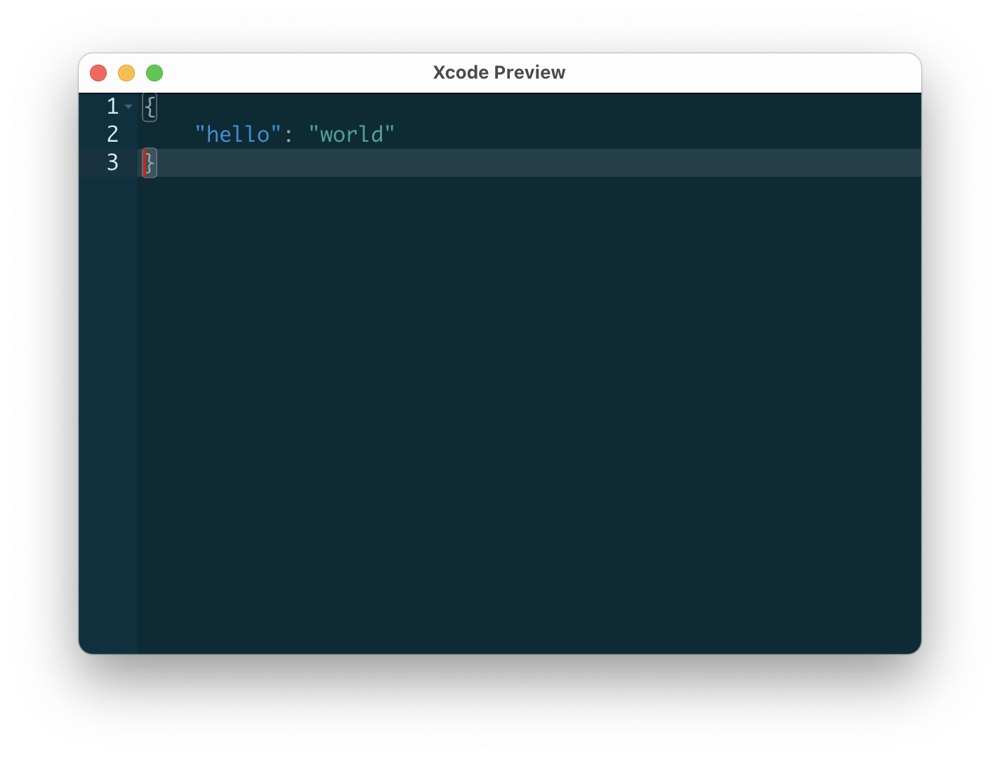
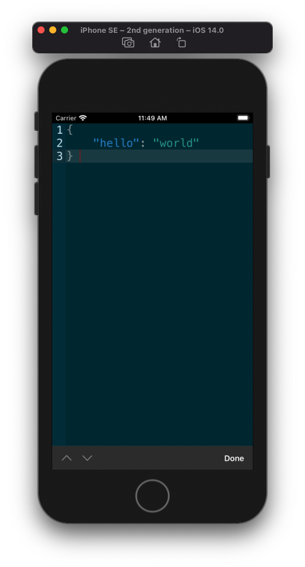

# CodeViewer

<p align="left">
	<a href="https://webuild.community">
        
	</a>
    
</p>

CodeViewer is a custom code editor SwiftUI view, which wrap around the [ace](http://ace.c9.io) editor.

<p align="center">
	
	
</p>

## Features

- [x] Darkmode, lightmode adopt automatically
- [x] Syntax highlighting for over 110 languages (TextMate/Sublime Text.tmlanguage files can be imported)
- [x] Over 20 themes (TextMate/Sublime Text .tmtheme files can be imported)
- [x] Support SwiftUI

## Usage

```Swift
import SwiftUI
import CodeViewer

struct ContentView: View {
    @State private var json = ""
    
    var body: some View {
        CodeViewer(
            content: $json,
            mode: .json,
            darkTheme: .solarized_dark,
            lightTheme: .solarized_light,
            isReadOnly: true,
            fontSize: 54
        )
        .onAppear {
            json = """
            {
                "hello": "world"
            }
            """
        }
    }
}

```

## Requirement
- iOS >= v13
- macOS >= v10.15
